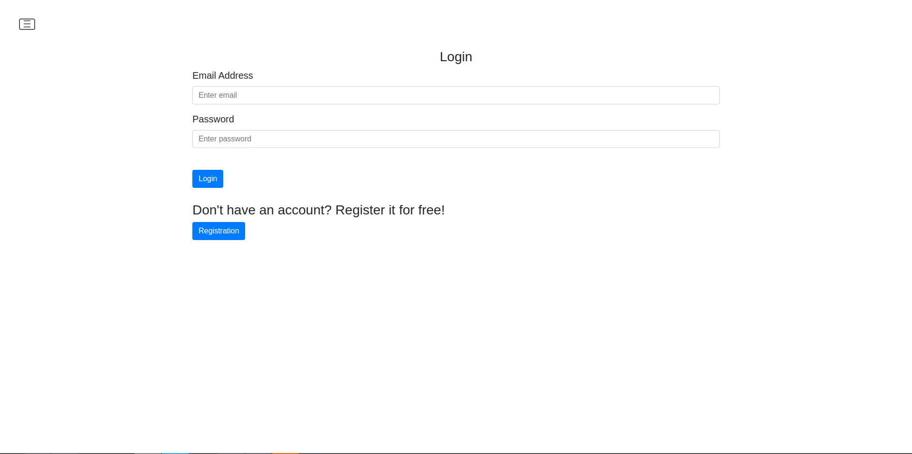
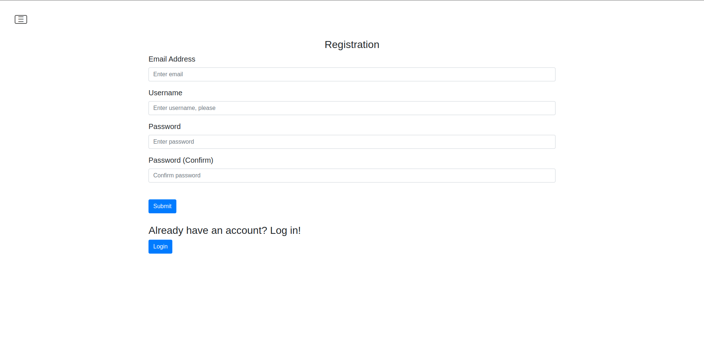
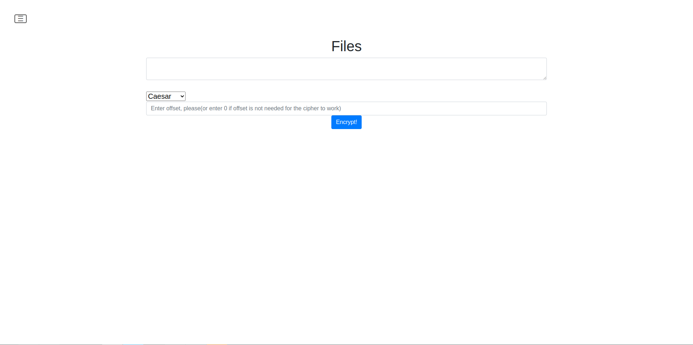
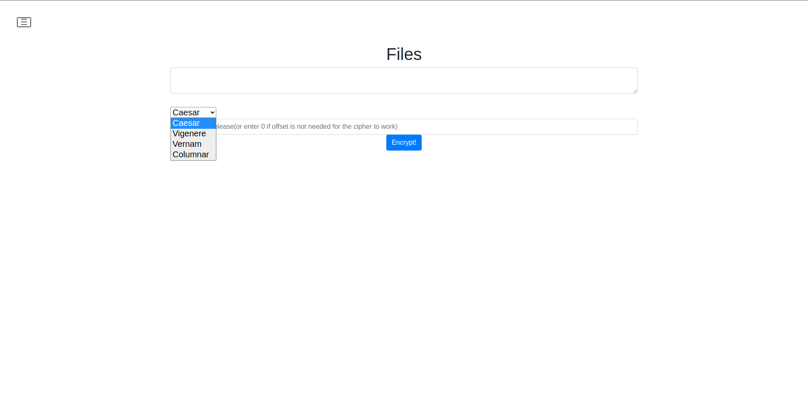

# WEBSITE

## Table of contents
  - [Installation]()
  - [Use Cases]()
  - [About]()
  - [Images]()


## Installation


```
git clone --branch dev git@github.com:VaganovAlexanderMih/Website_Python.git Website
cd Website
sudo apt update && sudo apt upgrade
sudo apt install python3
pip install requirentments.txt
python3 main.py
google-chrome http://127.0.0.1:5000
```


## Use Cases
When you get on the website, you have to register(or login, if you alreade have
an account). As you log in, there will be some menu's, that you can go by. If
you want to ecnrypt text, you have to go to the 'Encryption' menu, but if you
want to decrypt some text, you have to go to the 'Decryption' menu.


## About
This site was made for encrypting/decoding text. For encrypting text, go to the "encryption" title, for
decoding, go to the "decoding" title. You can choose the version of the cipher right in the title.


## Images


Login page




Registration page



Encryption page



Choosing the cipher